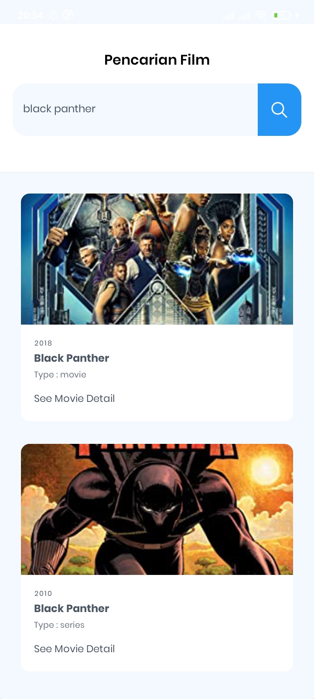
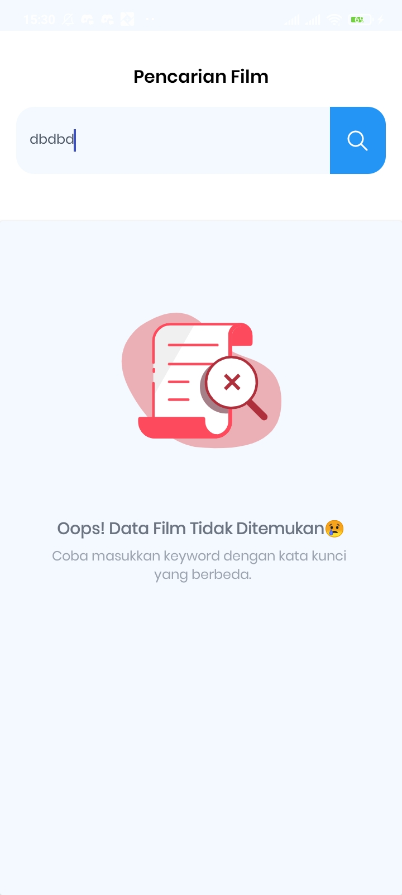

# Movie Catalog (Weekend Gabut Apps)

## Prerequiste

- [Kotlin](https://kotlinlang.org//)
- Android Studio

## Stacks

- Kotlin
- Retrofit + OKhttp
- RxJava
- Lottie Animation
- OMDb API

## Installation

1. Clone repository

```bash
$  git clone git remote add origin https://github.com/Zainal21/MovieCatalog.git
```
2. open your android studio and run

## Example Screen Capture Result

### 1. Splash Screen


### 2. Movie Search List



### 3. Movie Detail List
     


### 4. Not Found Screen



Copyright © 2022 by Muhamad Zainal Arifin

> The Project is Under MIT licensed.
