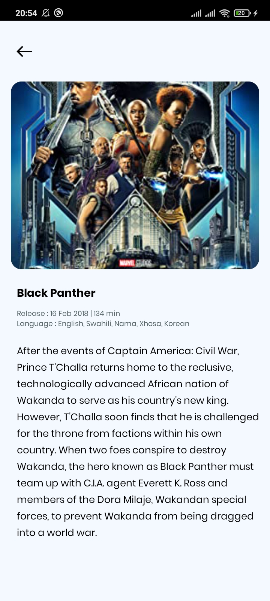

# Movie Catalog (Experiment Apps)

## Prerequiste

- [Kotlin](https://kotlinlang.org//)
- Android Studio

## Stacks

- Kotlin
- Retrofit + OKhttp
- RxJava
- OMDb API

## Installation

1. Clone repository

```bash
$  git clone git remote add origin https://github.com/Zainal21/MovieCatalog.git
```
2. open your android studio and run

## Example Screen Capture Result

- Splash Screen

{ width: 200px;height:600px }

- Movie Search List

{ width: 200px;height:600px }

- Movie Detail List

{ width: 200px;height:600px }

Copyright © 2022 by Muhamad Zainal Arifin

> The Project is Under MIT licensed.
